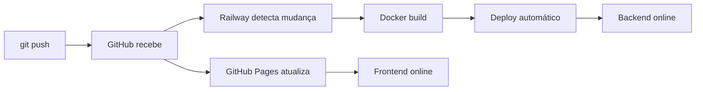

# Configuração de Ambientes - iDialog Ferramentas

## 🏗️ Desenvolvimento Local

**API URL:** `http://127.0.0.1:5001/api`  
**Frontend URL:** `http://localhost:8000` ou `file:///` (local)  
**Database:** SQLite local em `backend/idialog_tools.db`  

```powershell
# Terminal 1 - Backend
cd backend
python -m venv .venv
.venv\Scripts\activate
pip install -r requirements.txt
python app.py

# Terminal 2 - Frontend (opcional - serve estático)
python -m http.server 8000
```

---

## 🚀 Produção - GitHub Pages + Railway

### Frontend (GitHub Pages)

```
URL: https://Albertinoblima.github.io/idialog/
Branch: main
Automático: Atualiza a cada push
```

### Backend (Railway)

```
URL: https://seu-projeto.railway.app/api
Automático: Deploy a cada push em backend/
Logs: Railway Dashboard
```

### Configuração no Frontend em Produção

No arquivo `/pages/ferramentas/index.html`, o campo "API" deve apontar para:

```
https://seu-projeto.railway.app/api
```

Ou na primeira carga, configure via UI:

1. Abra <https://Albertinoblima.github.io/idialog/pages/ferramentas/>
2. No topo, campo "API"
3. Mude para `https://seu-projeto.railway.app/api`
4. Clique "Conectar"
5. A configuração é salva em `localStorage` do navegador

---

## 🔐 Variáveis de Ambiente

### Railway - Dashboard

1. Vá em "Project"
2. Selecione "Variables"
3. Adicione:

```
IDIALOG_SECRET_KEY=sua-chave-super-secreta-aleatorio-64-caracteres
IDIALOG_PLANNING_TEMPLATE=/app/backend/uploads/template.xlsm  (opcional)
```

### Como gerar IDIALOG_SECRET_KEY

**Python:**

```python
import secrets
print(secrets.token_urlsafe(32))
```

**PowerShell:**

```powershell
[System.Convert]::ToBase64String([System.Security.Cryptography.RandomNumberGenerator]::GetBytes(32))
```

**Linux/Mac:**

```bash
openssl rand -base64 32
```

---

## 📊 Monitoramento

### Railway

- Dashboard: <https://railway.app/dashboard>
- Logs em tempo real
- Alertas de erro
- Reinicialização automática

### GitHub Pages

- Status: <https://github.com/Albertinoblima/idialog/actions>
- Histórico de deploys
- Rollback simples (revert commit)

---

## 🔄 Processo de Deploy



---

## ⚠️ Troubleshooting

### Frontend não encontra a API

**Sintoma:** "Erro: Token não informado" ou "Falha ao conectar"

**Solução:**

1. Verifique URL no campo "API"
2. Teste direto: `https://seu-projeto.railway.app/api/health`
3. Se retornar `{"status": "ok"}`, API está ativa
4. Limpe cache: `Ctrl+Shift+Del`

### Railway não faz deploy

**Sintoma:** Status "Failed" ou "Crashed"

**Solução:**

1. Verificar Logs: Railway Dashboard → Logs
2. Comum: `requirements.txt` ausente ou `Procfile` mal formatado
3. Restartar: Railway Dashboard → Services → Restart

### GitHub Pages não atualiza

**Sintoma:** Código commitado mas site ainda mostra versão antiga

**Solução:**

1. Aguarde 1-2 minutos
2. Verifique em: GitHub → Actions (veja o workflow)
3. Limpe cache do navegador: `Ctrl+F5`
4. Verifique se push foi feito no branch `main`

---

## 📱 Teste de Integração

Após deploy em produção, teste:

```bash
# 1. Frontend está online?
curl -I https://Albertinoblima.github.io/idialog/pages/ferramentas/index.html

# 2. Backend está online?
curl https://seu-projeto.railway.app/api/health

# 3. CORS funcionando?
curl -H "Origin: https://Albertinoblima.github.io" \
     https://seu-projeto.railway.app/api/health
```

---

## 🎯 Próximos Passos

- [ ] Fazer push para GitHub
- [ ] Confirmar deploy em GitHub Pages
- [ ] Conectar Railway ao repositório
- [ ] Configurar variáveis de ambiente no Railway
- [ ] Testar login em produção
- [ ] Testar exportação de documentos
- [ ] Configurar backup diário do banco (Railway)

---

## 📚 Referências

- [Railway Docs](https://docs.railway.app/)
- [GitHub Pages Docs](https://docs.github.com/pages)
- [Flask Deployment](https://flask.palletsprojects.com/deployment/)
